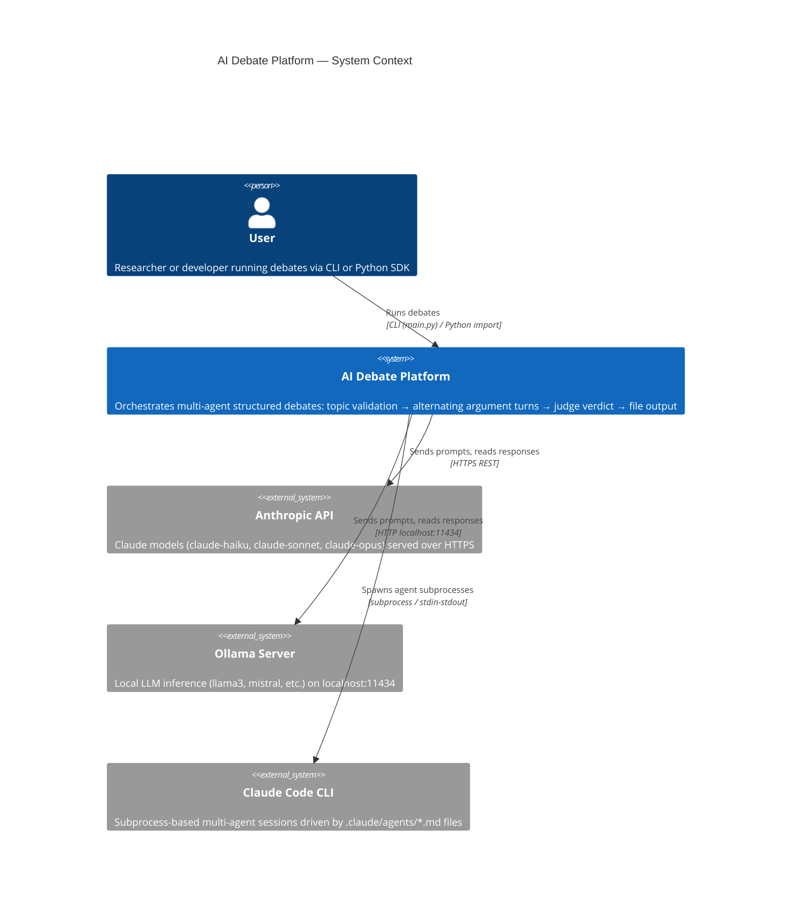
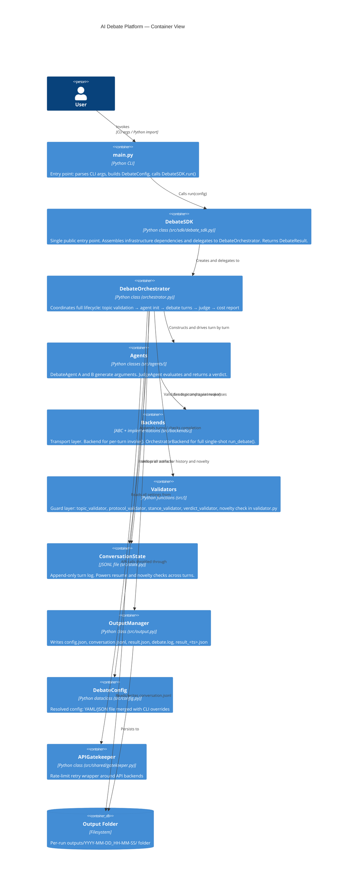
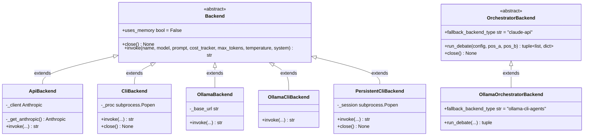
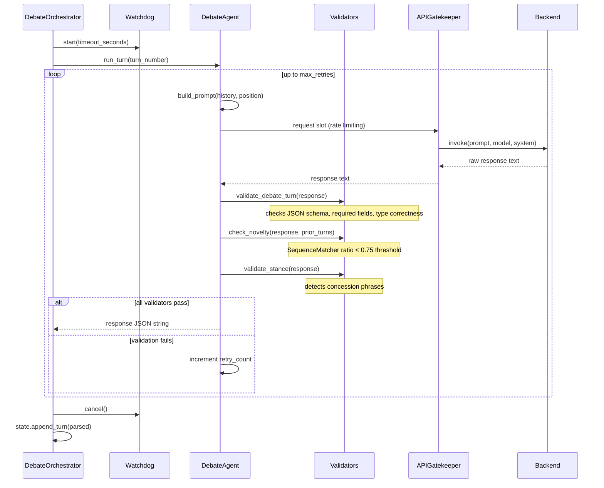
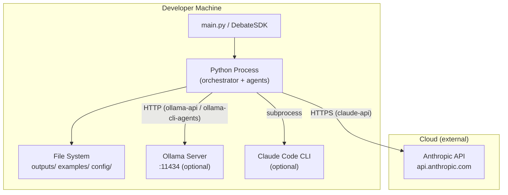

# Architecture — AI Debate Platform

Diagrams use [Mermaid](https://mermaid.js.org/) and render natively on GitHub/GitLab.

---

## 1. C4 Level 1 — System Context

Who uses the system and what external systems it talks to.

---

## 2. C4 Level 2 — Container View

The major deployable units and their responsibilities.

---

## 3. UML Class Diagram — Backend Hierarchy

Two independent ABC contracts served by different concrete backends.

**Key design rule:** `DebateOrchestrator` only ever calls `backend.invoke()` or `backend.run_debate()`. It never knows which concrete class it holds. Adding a new backend requires only implementing the matching ABC and registering it in `_factory.py`.

---

## 4. Sequence Diagram — Debate Turn Flow

What happens inside `DebateOrchestrator.run_turn()` for a single agent turn.

---

## 5. Deployment Diagram — Local vs Cloud

**Deployment modes:**
| Mode | Requires | Network |
|------|----------|---------|
| `claude-api` | `ANTHROPIC_API_KEY` env var | Cloud (Anthropic) |
| `ollama-api` | Ollama server running locally | Local only |
| `cli` / `claude-cli-agents` | Claude Code CLI installed | Cloud (via CLI auth) |
| `ollama-cli` / `ollama-cli-agents` | Ollama + Claude Code CLI | Local only |
